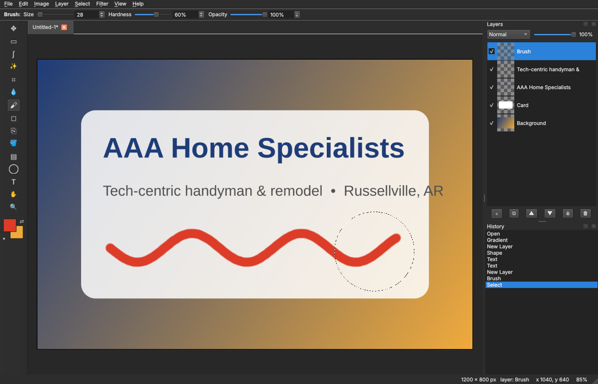

# PixelBench

A native, layer-based raster image editor in the spirit of Photopea / Photoshop, with **no browser involved**.
It is a plain desktop app built with Python + Qt (PySide6), NumPy, Pillow and SciPy. Runs on Windows, Linux and macOS.



## Features

**Layers**: unlimited layers, visibility, opacity, 14 blend modes (Normal, Multiply, Screen, Overlay, Darken,
Lighten, Color Dodge, Color Burn, Hard Light, Soft Light, Difference, Exclusion, Add, Subtract), lock, rename,
reorder, duplicate, merge down, merge visible, flatten, transform (scale / rotate / flip / offset with live preview).

**Tools** (keyboard shortcut in brackets):

| Tool | Key | Notes |
|---|---|---|
| Move | V | drags the layer or just the selected pixels; arrow keys nudge; auto-select layer option |
| Marquee | M | rectangle or ellipse; Shift add, Alt subtract, Shift+Alt intersect, Ctrl constrains; feather |
| Lasso | L | freehand or polygonal |
| Magic wand | W | tolerance, contiguous, sample all layers |
| Crop | C | drag, Enter / double-click to apply, Esc cancels |
| Eyedropper | I | Alt+click sets the background colour |
| Brush | B | size, hardness, opacity; `[` `]` resize; Shift+click draws straight lines |
| Eraser | E | same engine as the brush, erases to transparency |
| Clone stamp | S | Alt+click to set the source |
| Paint bucket | G | tolerance / contiguous / opacity, honours the selection |
| Gradient | Shift+G | linear, radial, reflected; FG→BG or FG→transparent |
| Shape | U | rectangle, rounded rectangle, ellipse, line; fill + stroke; optional new layer |
| Text | T | any installed font, size, bold/italic, alignment, colour; rasterised onto its own layer |
| Hand | H | or hold Space with any tool, or middle-drag |
| Zoom | Z | click / Alt+click / drag a box; Ctrl+wheel zooms at the cursor |

**Selections** are 8-bit masks, so feathered and anti-aliased edges work everywhere: painting, fills, filters,
clear, copy and paste all respect them. Select menu: all, deselect, invert, select layer contents, feather, grow, shrink.
Marching ants are animated.

**Filters & adjustments** (all with live preview and selection masking): Brightness/Contrast, Levels, Exposure,
Hue/Saturation, Vibrance, Color Balance, Auto Levels, Equalize, Invert, Desaturate, Threshold, Posterize, Sepia,
Gaussian / Box / Motion blur, Median, Sharpen, Unsharp Mask, Pixelate, Add Noise, Emboss, Find Edges, Solarize,
Vignette. Ctrl+F repeats the last filter.

**Image**: resize (Nearest/Bilinear/Bicubic/Lanczos), canvas size with anchor, crop to selection, trim transparent
edges, rotate 90/180, flip.

**Files**: opens PNG, JPEG, WebP, BMP, GIF, TIFF, ICO, TGA and **PSD/PSB** (layers, names, opacity, visibility and blend
modes are kept; groups are flattened to a list). Saves layered documents as `.pxb` (a zip of PNGs + JSON) and exports
flattened PNG / JPEG / WebP / BMP / GIF / TIFF / ICO. Drag and drop files onto the window. Paste an image from the
clipboard as a new layer or a new document.

**Workspace**: multiple documents in tabs, unlimited undo/redo with a clickable History panel, dark theme, status bar
with cursor position and zoom, layout is remembered between runs.

## Run from source

```bash
pip install -r requirements.txt
python pixelbench.py                 # or: python -m pixelbench
python pixelbench.py photo.jpg ...   # open files on launch
```

Python 3.10+ is required. On a bare Linux server you also need the usual Qt system libraries
(`libegl1 libgl1 libxkbcommon0 libfontconfig1 libdbus-1-3`).

## Build a standalone executable

```bash
pip install pyinstaller
python build.py            # dist/PixelBench/  (one-folder, fastest start)
python build.py --onefile  # single file
```

Build on the OS you are targeting (Windows build for the Windows machines, Linux build for the server).

## Tests

```bash
pip install pytest
pytest
```

The suite covers compositing and blend modes, undo/redo, file round-trips, every filter, selection maths, and a set
of UI smoke tests that drive the real widgets through synthetic mouse events on Qt's offscreen platform.

## Layout

```
pixelbench/
  blend.py       blend modes + compositing (NumPy, W3C formulas)
  document.py    Document / Layer model, whole-image operations, undo snapshots
  history.py     snapshot undo/redo with copy-on-write layers
  fileio.py      open / save / export, PSD import, native .pxb format
  filters.py     adjustments and filters + the Filter menu registry
  selection.py   selection masks, magic wand, feather/grow, outline for ants
  tools.py       all interactive tools (stroke engine, selection tools, move, crop, text, shapes...)
  canvas.py      the zoomable document view
  panels.py      tool box, options bar, swatches, Layers and History panels
  dialogs.py     new / resize / canvas / filter / text / transform / export dialogs
  mainwindow.py  menus, tabs, docks, commands
tests/           pytest suite
build.py         PyInstaller build
docs/            notes and screenshot
```

See `docs/PIXELBENCH_NOTES.md` for design notes, known gaps and the roadmap.

---
*This repository started life as a "random thoughts" scratch repo; PixelBench now lives here.*
